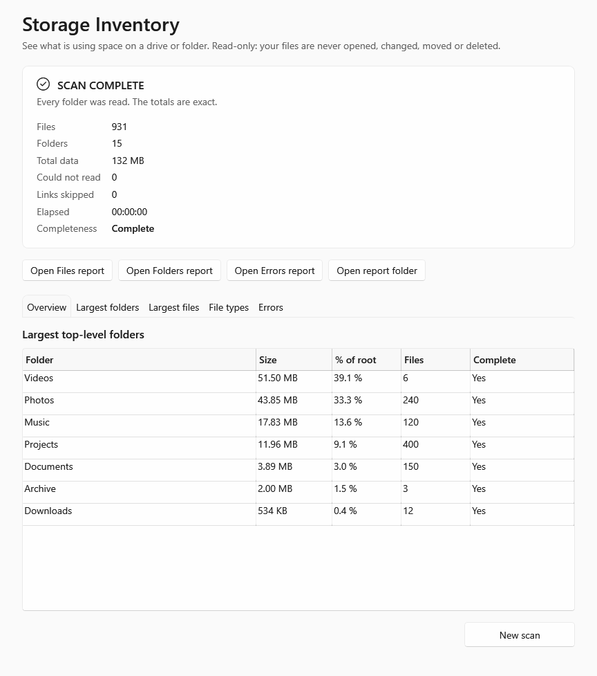

# StorageInventory

**A read-only storage inventory for Windows.** StorageInventory scans a drive or folder and tells you what is using the
space: every file and folder, with sizes, dates and attributes, written to CSV reports you can keep, sort and compare. It
only ever reads filesystem metadata. It never opens, changes, moves or deletes your files, and it says plainly when a
scan could not see everything.

**Version 1.0.0** · Windows 10 and 11 (x64) · [MIT License](LICENSE)



## Why it exists

Disk-space visualisers are good at answering "what's big right now?" on screen. StorageInventory is built for a
slightly different job: a **complete, auditable inventory** that you can keep.

- **Reports, not just a picture.** Every file and folder goes into CSV reports (and optionally an Excel workbook) that
  you can filter, archive and compare later.
- **Honest about completeness.** A folder it couldn't read is listed as an error, and every total that includes it is
  marked as a lower bound. A partial scan never looks complete.
- **Safe by construction.** Links are never followed, file contents are never opened, and reports can't overwrite
  anything or be written inside the folder being scanned.
- **A foundation for history.** The scanning engine (`StorageInventory.Core`) is a reusable library. The next version
  is planned to keep scans as snapshots and report what changed between them. That is **not in 1.0**; see the
  [roadmap](docs/roadmap.md).

## Features (1.0)

- **Native Windows app** (WPF), following the system light or dark theme, with keyboard access and screen-reader
  labels. It doesn't need administrator rights.
- **Pre-flight check** before anything happens: missing folders, reports inside the source, links in either path,
  aliases such as SUBST drives, network or OneDrive locations. Anything blocked is explained in plain words, and the
  scan can't start.
- **Recursive, metadata-only scan** with live counters and a Cancel button. The progress bar never invents a
  percentage while the total is unknown.
- **Four explicit outcomes:** *Complete*, *Finished but incomplete*, *Cancelled* or *Failed*.
- **Reports** in the folder you choose, each named with the date, time and a random run ID so nothing is ever
  replaced:
  - `Files_<run>.csv`: every file, with name, extension, type category, relative and full path, size (bytes, KB, MB,
    GB), created, modified and last-access times, and attributes. Largest first by default.
  - `Folders_<run>.csv`: every folder, with direct and total size, percentage of the root and of its parent, file and
    subfolder counts, largest file, read status and whether everything beneath it was readable.
  - `ScanErrors_<run>.csv`: every unreadable location, every link that was skipped, and every file that is itself a
    link.
  - Optional `StorageInventory_<run>.xlsx`, built from the finished CSVs. Excel doesn't need to be installed, and the
    workbook contains no formulas or hyperlinks.
- **Results screen:** a summary, the largest top-level folders, and tabs for the largest folders, largest files, file
  types and errors, read from the finished reports. Buttons open a report or the report folder, and only when you
  click them.
- **Built for big trees:** file rows stream to disk as they are found. Sorting largest-first keeps a compact index of
  24 bytes per file rather than the files themselves, and an unsorted mode skips sorting entirely.
- **Self-contained executable:** one `StorageInventory.exe`, with no .NET installation required.

A PowerShell implementation, [`powershell/StorageInventory.ps1`](powershell/README.md), is also included. It produces
the same reports and serves as the behavioural reference the native app is tested against.

## Safety model

**What StorageInventory reads:** folder listings and the metadata they return (names, sizes, timestamps,
attributes), plus a link's own target description. File contents are never opened.

**What StorageInventory writes:** only inside the report folder you choose, which must be outside the folder being
scanned:

- the report folder itself, if it doesn't exist yet;
- the three CSV reports, always created as **new** files (creation fails rather than overwrite);
- in sorted mode, a temporary `Files_<run>.unsorted.tmp`, which is deleted once the sorted report is written;
- if you ask for it, the workbook, written as `.xlsx.partial` and renamed only when complete.

Nothing else: no settings, no registry entries, no logs elsewhere. (The single-file executable's .NET host unpacks a few
WPF system libraries to `%TEMP%\.net\StorageInventory\`; that is runtime behaviour and never touches your folders or
reports.)

**Links and reparse points:** junctions, symbolic links, mount points and cloud placeholders are listed and **never
followed**. A file that is a link is counted at its own listed size, and its target is never opened.

**Cancelled or failed scans** leave the reports they had started, closed and clearly listed as incomplete. Nothing is
deleted automatically, and nothing in the scanned folder is affected.

**No network activity of its own:** no telemetry, analytics, update checks or uploads. A network location is only
accessed if you choose one as the source or the report folder, through normal Windows file sharing, with a warning
first.

**Remaining limitations** are documented honestly. The main ones are below, and the full analysis is in the
[security review](docs/native-security-review.md).

> **Your reports are private data.** They list file and folder names, the directory structure, sizes and timestamps.
> Treat them like the folders they describe, and review them before sharing. StorageInventory never uploads them, but
> a report folder inside OneDrive or another synced location will be uploaded by that service (the pre-flight check
> warns about OneDrive).

## Download and run

1. Download `StorageInventory.exe` from the [Releases](https://github.com/eunni-dotcom/StorageInventory/releases) page.
2. Optionally, check it against the SHA-256 in the release notes:
   ```powershell
   Get-FileHash .\StorageInventory.exe -Algorithm SHA256
   ```
3. Run it. No installation is needed; it runs from any folder.

**The executable is not code-signed**, so Windows SmartScreen may say it "protected your PC" the first time. If the
checksum matches, choose **More info → Run anyway**. You can also build it yourself from source (below).

## Usage

1. **Folder or drive to scan:** type a path or use **Browse…**.
2. **Save reports to:** a folder outside the source, for example on another drive. It is created if it doesn't exist.
3. **Check the pre-flight panel.**
   - **READY TO SCAN** or **READY, WITH WARNINGS** lets you start.
   - **BLOCKED** explains why ("Why is this blocked?") and what to change.
4. **Options:**
   - Untick **Sort individual files largest-first** to go faster on huge trees.
   - Tick **Also create an Excel workbook (.xlsx)** if you want one.
5. **Start scan.** You can cancel at any time. Closing the window during a scan asks first, then waits until the
   reports are closed.
6. **Read the outcome** and browse the tabs. **Open Files report** and **Open report folder** take you further.

## Building from source

Requirements: Windows 10 or 11 x64 and Windows PowerShell 5.1 (built in). The toolchain is **repo-local**: nothing is
installed machine-wide, and CLI telemetry is switched off.

```powershell
.\tools\fetch-tools.ps1                           # once: .NET SDK 10, portable PowerShell 7, ImportExcel (tests only), all hash-verified
.\build.ps1 -Target Build                         # Debug build
.\build.ps1 -Target Test -Configuration Release   # unit and integration tests
.\build.ps1 -Target Publish                       # dist\StorageInventory.exe (self-contained, single file) and its SHA-256
```

`build.ps1` keeps all .NET and NuGet state inside the repository and restores your environment afterwards. Exactly
four packages are referenced, all by the one project that holds the Library code (`src/StorageInventory.Library`; the shipped
application does not call it yet, so nothing is stored anywhere in this release):
`Microsoft.Data.Sqlite.Core` 10.0.12, `SQLitePCLRaw.core`, `SQLitePCLRaw.provider.e_sqlite3` and
`SQLitePCLRaw.lib.e_sqlite3` 2.1.12, which carries `e_sqlite3.dll` (SQLite 3.53.3, win-x64). Their versions and content
hashes are pinned by the committed `packages.lock.json` files, which a CI or publish restore must match exactly, and
the other projects (the scanner, the app) reference no package. The only other packages ever downloaded are Microsoft's
two official .NET runtime packs, which the self-contained publish needs; [`nuget.config`](nuget.config) names every
allowed package by its exact ID and refuses anything else. The single-file executable bundles `e_sqlite3.dll`, which the
.NET host extracts next to the other native files (see [docs/release.md](docs/release.md)); licences are in
[THIRD-PARTY-NOTICES.md](THIRD-PARTY-NOTICES.md). A publish from a clean checkout is reproducible byte for byte.

## Testing

- **Unit tests** (`tests/StorageInventory.Core.Tests`): path normalisation, aggregation invariants, report formatting,
  CSV and workbook writers, and result contracts.
- **Identity tests** (`tests/StorageInventory.History.Tests`): the rules that recognise a drive or folder again (confidence,
  matching, end-of-scan re-verification) over fake evidence, with no filesystem.
- **Integration tests** (`tests/StorageInventory.IntegrationTests`) run against an adversarial fixture tree:
  - junction loops, links pointing outside the tree, and deny-ACL folders;
  - paths over 260 characters, Unicode and emoji names, formula-like names, and invalid timestamps.

  They cover:
  - path policy, the scan engine, and folder totals against brute-force recomputation;
  - report pipelines, cancellation and write failures;
  - the UI, driven through the real window;
  - a **security audit** that fails if write, delete, launch, network, registry or native-code APIs appear outside
    their audited places;
  - **parity**: the native reports must match the PowerShell reference line for line.
- **PowerShell reference suite** (`powershell/tests`) and a **release smoke test** (`tests/smoke`), which drives the
  published exe from outside the repository.

CI builds, tests and publishes every change on GitHub Actions. Tests that need something a hosted runner lacks
(8.3 names, large benchmark trees) report SKIP with a reason. The hosted runner can create symbolic links, so CI exercises the symbolic-link cases that need privileges locally.

## Documentation

| Document | Contents |
|---|---|
| [Architecture](docs/architecture.md) | Core library, app and future layers; extension points |
| [Security review](docs/native-security-review.md) | Safety contract, API inventory, adversarial checks, residual risks |
| [Path policy](docs/native-path-policy.md) | How source and report paths are validated |
| [Parity report](docs/native-parity-report.md) | Native app vs PowerShell reference |
| [Release build](docs/release.md) | Reproducing and verifying the executable |
| [Benchmarks](docs/benchmarks/native.md) | Measured performance, with method and caveats |
| [Roadmap](docs/roadmap.md) | What's next, and what is permanently out of scope |
| [Integration boundary](docs/integration-consumers.md) | How other tools are expected to consume scan results |
| [v1.0.0 release notes](docs/release-notes/v1.0.0.md) | What's in this release |

## Known limitations

- **Mount points and 8.3 short-name aliases** go through the same code paths as the tested junctions and aliases,
  but aren't created by the test suite. (Symbolic links are tested in CI, where the runner has the privilege to create
  them.)
- **A folder swapped for a link mid-scan** (in the moment between being listed and being entered) can still be
  followed. The window is very small, and the worst case is a read-only listing of the link's target.
- **`\\localhost\C$`-style aliases** of the source can't be resolved in advance. A tripwire stops the scan if it meets
  its own reports, but by then the first report files exist in that folder.
- **Counting:** hard links are counted once per link. Sizes are file lengths, not space used on disk (compression,
  sparse files and cluster slack aren't reflected). Alternate data streams aren't counted.
- **Not code-signed**, so SmartScreen may warn (see above).
- **Single-file extraction:** WPF's native libraries, and `e_sqlite3.dll` (the SQLite engine bundled for the Library code,
  not yet used by the application), are unpacked to `%TEMP%\.net\StorageInventory\` on first run.
- **Windows only**, x64 only.

## Roadmap

**1.1: persistent inventory** (planned, no date). The plan:
- keep completed scans as snapshots;
- identify volumes independently of drive letters;
- report what was added, changed or missing between scans.

Anything under an unreadable folder will be reported as *unknown*, never as deleted. Details and the permanent
non-goals (content inspection, hashing, deleting or moving files, telemetry) are in [docs/roadmap.md](docs/roadmap.md).

## Contributing and security

- Contributions are welcome; see [CONTRIBUTING.md](CONTRIBUTING.md).
- Please report security problems privately, as described in [SECURITY.md](SECURITY.md), not as public issues.

## Licence

[MIT](LICENSE) © 2026 eunni-dotcom. The release executable bundles the MIT-licensed .NET runtime, `Microsoft.Data.Sqlite`
(MIT), SQLitePCLRaw (Apache-2.0) and SQLite (public domain); see [THIRD-PARTY-NOTICES.md](THIRD-PARTY-NOTICES.md).
